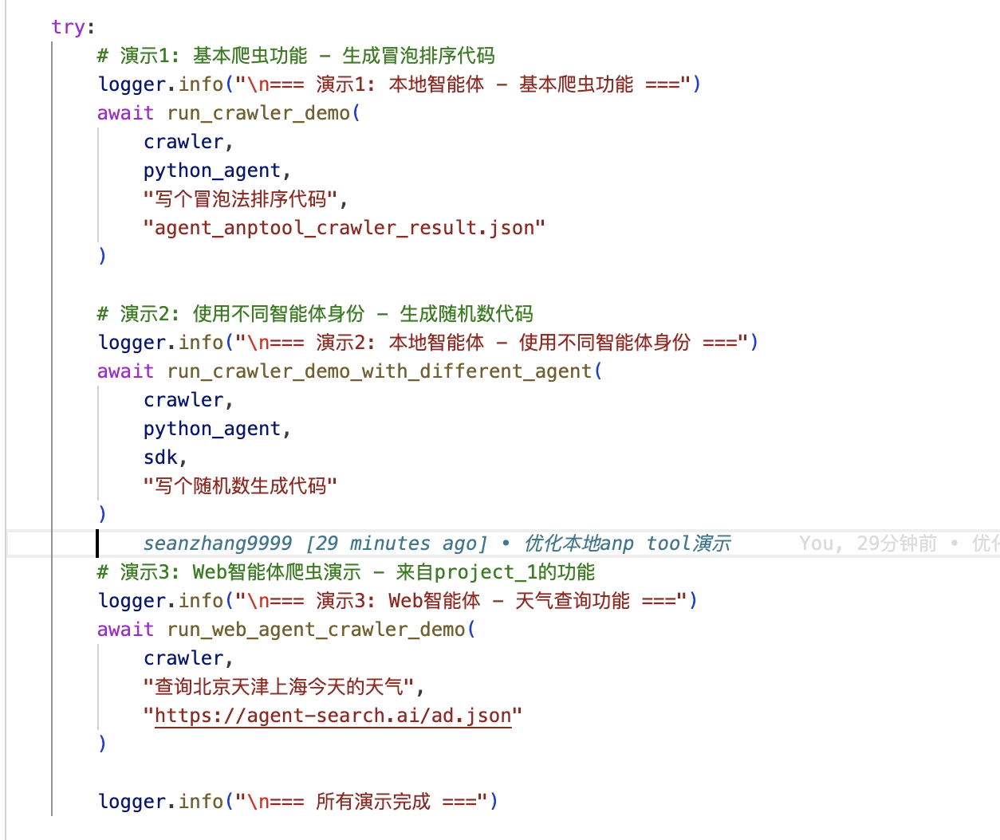
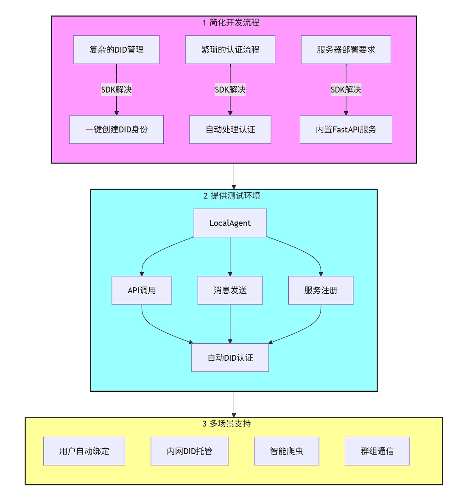
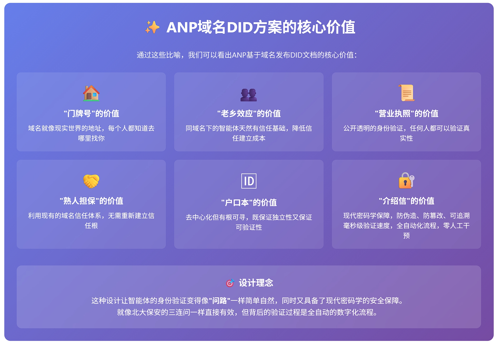
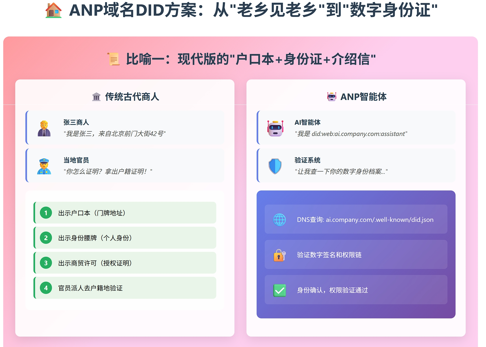
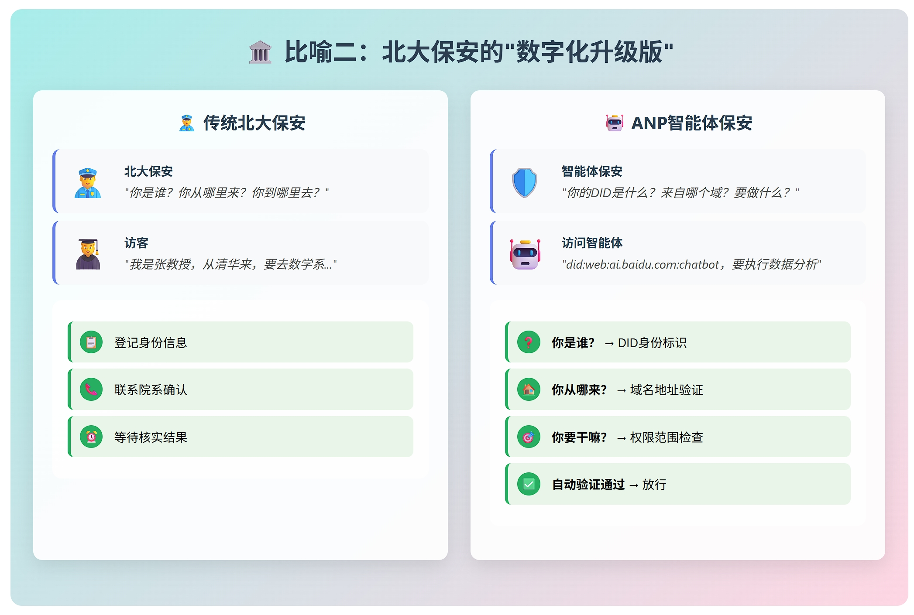
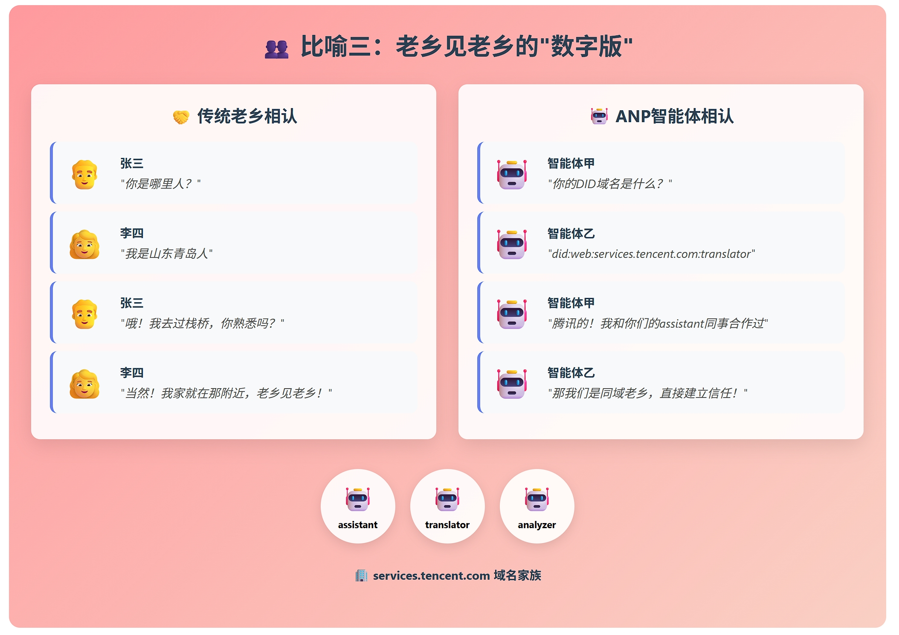
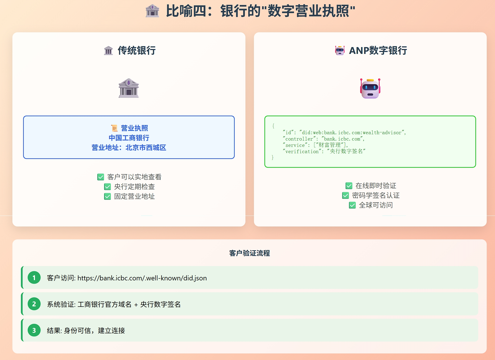
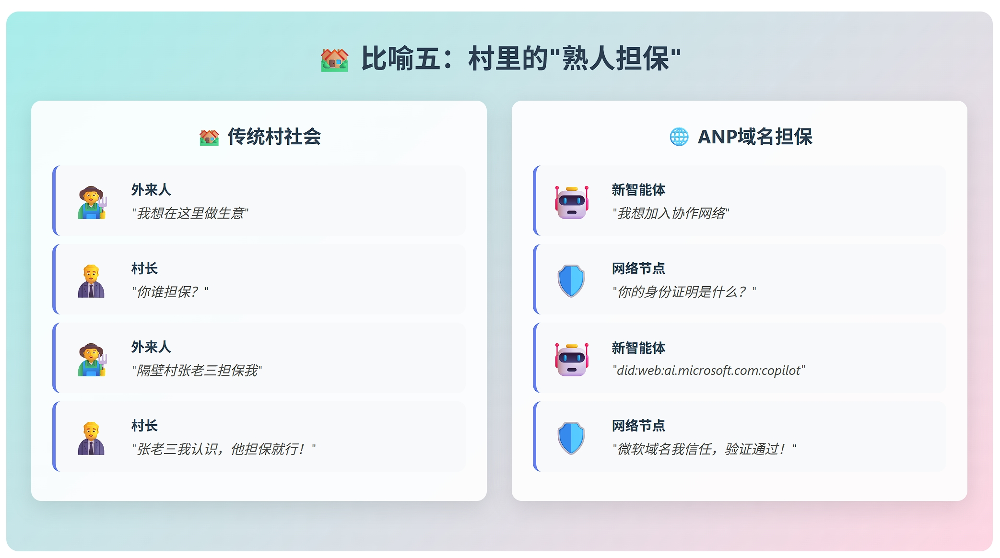
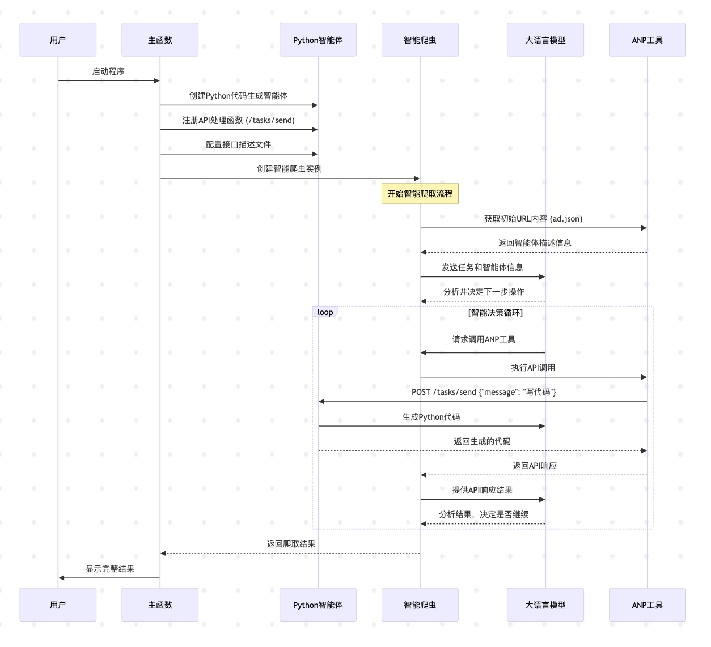
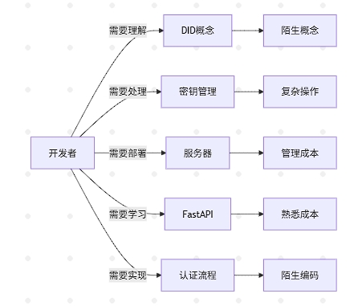

# anp agent opensdk

anp agent opensdk是基于ANP核心协议栈agent_connect开发的一个anp快速集成开发工具包

## 快速上手

- 克隆项目
- python -m venv .venv
- 激活.venv
- poetry install
- python project_1_anp_tool_crawler_to_web_agent.py
- python project_2_anp_tool_crawler_to_local_agent_optimized.py
- python project_1_anp_tool_crawler_to_web_agent.py

## 场景体验
通过sdk，可以快速上手，在自己的开发环境上实现anp的四个场景，当前进度：1和2已完成

[1 演示代码](project_1_anp_tool_crawler_to_web_agent.py)

[2 演示代码](project_2_anp_tool_crawler_to_local_agent.py)

1. ### 自己跑起来 ANP Explorer同款

   无需复杂配置，一键启动智能体发现之旅

在本地轻松运行ANP资源浏览器，实现与 https://service.agent-network-protocol.com/anp-demo/ 相同的强大功能。这个智能爬虫不仅能够自由探索和发现网络中的ANP资源，还能智能化地分析和展示各类智能体的能力与服务。

核心优势：

🚀 零配置启动，开箱即用
🔍 智能资源发现与分类
📊 可视化展示ANP生态全貌
🛡️ 安全可靠的资源访问

2. ### Explorer web和我的Agent

   智能爬虫，几行代码自动调用本地和web的anp服务

在本地快速搭建属于自己的ANP智能体，并通过1中的Explorer进行智能调用。无论是简单的对话机器人还是复杂的业务处理系统，都能轻松接入ANP网络，让你的智能爬虫能够智能化地发现、连接和使用你的专属智能体。

独特亮点：

🎯 可视化Agent创建向导
🔗 一键接入ANP网络
📈 实时监控Agent性能
🎨 个性化展示界面
创建流程：

选择Agent模板或自定义
配置能力描述和API接口
一键发布到ANP网络
通过Explorer实时测试和调试


3. ### 我的多 Agent 服务与互联

   化繁为简，让智能体协作如丝般顺滑

将现有的智能体框架通过简单的几行代码，瞬间转化为多个相互协作的ANP智能体。它们可以互发消息、互调API，不再纠结本地运行还是远程部署，无论如何调整，都可以无缝通过anp的did进行协作

核心优势：

⚡ 极简集成，几行代码搞定
🔄 智能消息路由与API调用
🏗️ 可视化Workflow构建
📊 统一监控与管理面板

4. ### 跨越网络边界的 Agent 组群

   突破物理限制，构建无界智能体联盟

在本地运行一个智能体群落管理系统，让多个智能体能够简单、安全、可信地建立协同"圈子"。无论智能体分布在世界何处，都能通过ANP协议实现无缝连接和协作，打造真正的分布式智能网络。

独特价值：

🌐 跨网络、跨平台智能体发现
🔐 端到端加密通信保障
🤝 基于信任度的智能匹配
🎯 动态组群管理与优化
组群构建流程：

启动本地ANP节点
设置信任策略和协作规则
智能发现和邀请相关Agent
建立安全通信隧道
开始跨网络智能协作
让智能体不再孤单，让AI协作成为现实！

## 项目目标



- 简化对智能体开发者使用ANP协议的WBA-DID认证的开发流程，降低开发复杂度

  - 一个函数直接创建anp用户密钥文件夹和相关DID文档，DID标识符格式符合ANP协议要求，开发者熟悉后可以自己修改
  - 拥有密钥文件夹后，import SDK，一行代码创建LocalAgent（ANP的网络连接实例）
- 提供开发者本地快速测试环境，支持快速迭代和调试多智能体互操作

  - LocalAgent可以调用其他agent的api，向其他agent发送消息，请求中自动进行DID认证，开发者无需操作
  - LocalAgent可以注册到SDK的FastAPI服务上，支持多个LocalAgent并存
    - 对外发布自身DID文档、智能体描述json文件
    - FastAPI服务为注册LocalAgent默认提供接收其他agent发送消息的消息监听接口，开发者可以直接注册处理函数
    - LocalAgent可以通过装饰器、函数注册将本地API一行代码转换为Agent的API，自动发布到FastAPI服务，方便其他agent调用
    - 所有调用事件均传入调用者DID，并且已经进行过验证，开发者可以自由定制对不同调用者DID的权限控制
- 为几种DID使用场景提供解决方案和示例代码

  - 用户自动绑定模式：
    - 如果开发者给用户提供服务时，希望让用户访问anp服务，但是又不想麻烦用户了解DID，可以利用SDK自动给用户创建身份，自动发布DID文档到FastAPI服务，并将用户的DID与其服务进行绑定，访问ANP其他agent获取服务，一个FastAPI可以多租户服务
  - 内网公共服务器发布DID文档模式：
    - 如果开发者给企业开发时，希望所有DID文档发布在一个公共服务器，但是agent运行在不同笔记本/桌面电脑，可以利用SDK的hosted DID模式，将本地agent的DID文档自动邮件提交给公共服务器管理员，公共服务器进行审核和发布，并将最终公共服务器host的DID文档发还本地agent，此后本地agent可以使用这个DID文档自由访问其他agent
  - ANPTool模式：
    - ANP的特色能力，通过大模型自动连接分析其他anp agent提供的ad.json及链接的url，自动调用其中描述的api，完成用户功能
  - GroupRunner模式：
    - 不同网络的agent可以在一个公共服务器上加入一个Group，通过SSE监听响应消息，
    - 消息处理成员管理功能由创建者管理的GroupRunner具体执行，
    - GroupRunner可以继承扩展，自定义各种额外行为，方便跨网agent尽可能安全的互相连接，
    - 在GroupRunner中，成员可以通过DID进行身份验证，确保消息的安全性和隐私性。

## 核心功能

1. DID 身份管理
   创建去中心化身份（DID）
   DID 与域名绑定
   DID 文档发布和管理
   支持托管 DID 模式
2. 智能体通信
   点对点消息：智能体间直接消息传递
   API 调用：RESTful API 的发布和调用
   群组通信：基于 SSE 的群组消息功能
   双向认证：安全的身份验证机制，当前支持三种模式兼容：
   - 请求者提交DID认证，响应者验证，不返回token（一次一验）
   - 请求者提交DID认证，响应者验证，返回token（方便后续访问）
   - 请求者提交DID认证，响应者验证后，返回token，并返回自己DID认证（双向认证）
3. 服务发现与互操作
   智能体可信信息发布（ad.json/yaml/did文档接口，可以自定义）
   智能爬虫功能（anp_tool）
   智能体发现（提供了查询接口，可以自定义）

## 快速运行演示

1. 克隆项目
2. python创建venv环境，并进入venv环境
3. 使用poetry安装依赖
4. python anp_demo_main.py

```
   python anp_demo_main.py [-h] [-d] [-s] [-f] [--domain DOMAIN]
   参数说明：
   -h, --help       显示帮助信息
   -d               开发测试模式（默认）- 包含详细日志输出
   -s               步骤执行模式 - 每个步骤暂停等待确认，适合学习
   -f               快速执行模式 - 跳过所有暂停，适合自动化测试
```

## 主要演示内容

anp_sdk_demo/demo_modules/demo_tasks.py中是调用sdk的逻辑代码，按具体执行目标在 run_all_demos依次调用，可以选择性注释其他deme，专门运行一个进行分析

```python
async def run_all_demos(self):
        """运行所有演示"""
        if len(self.agents) < 3:
            logger.error("智能体不足，无法执行演示")
            return

        agent1, agent2, agent3 = self.agents[0], self.agents[1], self.agents[2]

        try:

            await self.run_api_demo(agent1, agent2)
            await self.run_message_demo(agent2, agent3, agent1)
            await self.run_agent_lifecycle_demo(agent1,agent2,agent3)
            await self.run_anp_tool_crawler_agent_search_ai_ad_jason(agent1, agent2)
            await self.run_hosted_did_demo(agent1)  # 添加托管 DID 演示
            await self.run_group_chat_demo(agent1, agent2,agent3)
            self.step_helper.pause("所有演示完成")
  
        except Exception as e:
            logger.error(f"演示执行过程中发生错误: {e}")
            raise
```

1. API 调用演示 (run_api_demo)
   - 展示智能体间的 API 调用功能
   - 演示 POST/GET 请求到其他智能体的接口
   - 显示智能体的 ad.json 信息
2. 消息传递演示 (run_message_demo)
   - 演示点对点消息发送
   - 展示消息自动回复功能
   - 多个智能体间的消息交互
3. 智能体生命周期演示 (run_agent_lifecycle_demo)
   - 可以用于用户自动绑定逻辑，快速创建一个用户的身份，可以发消息调api，did文档托管在开发者侧
   - 动态创建临时智能体
   - 注册消息处理器
   - 智能体间消息交互
   - 智能体的注销和清理
4. ANP 工具爬虫演示 (run_anp_tool_crawler_agent_search_ai_ad_jason)
   - 使用 ANP 协议进行智能体信息爬取（使用公网共享爽身份，爬取公网demo）
   - 智能爬虫自主决定爬取路径
   - 支持双向认证的安全爬取
   - 集成 AI 模型进行智能分析和决策
5. 托管 DID 演示 (run_hosted_did_demo)
   - 申请托管 DID
   - 查询托管状态
   - 托管智能体与普通智能体的消息交互
   - 托管智能体之间的通信
6. 群组聊天演示 (run_group_chat_demo)
   - 创建和加入群组
   - 群组消息广播
   - 审核群聊功能（消息过滤）
   - 群组成员管理
   - 消息存储和统计功能

## 演示模式

- 开发模式（-d）：适合开发调试，包含详细的日志输出
- 步骤模式（-s）：每个演示步骤都会暂停，适合学习和理解
- 快速模式（-f）：跳过所有暂停，适合自动化测试

## 🔧 集成指南

  基础智能体集成只需八步

1. 创建 DID 身份，此时在anp_open_sdk/anp_users建立DID用户目录，存储密钥/did doc/配置文件

   ```python
      from anp_open_sdk.anp_sdk_tool import did_create_user
        params = {
            'name': 'MyAgent',
            'host': 'localhost',
            'port': 9527,
            'dir': 'wba',
            'type': 'agent'
        }
        did_document = did_create_user(params)
   ```
2. 初始化 SDK，ANPSDK可以启动一个fastapi服务，LocalAgent将在本地DID用户目录按agent的did查找对应密钥文件，并加载初始化，如果只想调用其他agent的api，此时已经可以直接使用，如果需要发布did文档和api，将agent注册到sdk实例

   ```python
      from anp_open_sdk.anp_sdk import ANPSDK, LocalAgent

      sdk = ANPSDK(host="localhost", port=9527)
      agent = LocalAgent(sdk, did_document['id'])
      sdk.register_agent(agent)
   ```
3. 注册消息处理器，以便接收消息

   ```python
       @agent.register_message_handler("*")
       def handle_message(msg):
           print(f"收到消息: {msg}")
           return {"reply": "消息已收到"}
   ```
4. 注册 API 端点及响应函数

   ```python
           @agent.register_api_handler("/info", methods=["GET", "POST"])   
           async def handle_info(request):   
               return {"name": agent.name, "status": "online"}   
   ```
5. 启动服务，sdk启动后，agent注册的消息处理器和API端点自动上线，所有请求会自动路由到agent响应。

   ```python
           sdk.start_server()
   ```
6. 调用其他智能体 API，实现智能体间服务调用

   ```python
       # POST请求调用其他agent的API
       resp = await agent_api_call_post(
           sdk, agent1.id, agent2.id, "/info", {"from": agent1.name}
       )
       print(f"{agent1.name}POST调用{agent2.name}的/info接口响应: {resp}")

       # GET请求调用其他agent的API
       resp = await agent_api_call_get(
           sdk, agent1.id, agent2.id, "/info", {"from": agent1.name}
       )
       print(f"{agent1.name}GET调用{agent2.name}的/info接口响应: {resp}")
   ```
7. 发送点对点消息，实现智能体间直接通信

   ```python
       # 向其他agent发送消息
       resp = await agent_msg_post(
           sdk, agent2.id, agent3.id, f"你好，我是{agent2.name}"
       )
       print(f"{agent2.name}向{agent3.name}发送消息响应: {resp}")

       # 发送更复杂的消息内容
       resp = await agent_msg_post(
           sdk, temp_agent.id, agent2.id, f"你好，我是{temp_agent.name}"
       )
       print(f"[{temp_agent.name}] 已发送消息给 {agent2.name},响应: {resp}")
   ```
8. 使用 ANP Tool 智能爬虫，自动发现和调用其他智能体服务

   ```python
      # 定义爬虫任务
        task = {
            "input": "查询北京天津上海今天的天气",
            "type": "weather_query",
        }

        # 定义搜索智能体的提示模板
        SEARCH_AGENT_PROMPT_TEMPLATE = """
        你是一个通用智能网络数据探索工具。你的目标是通过递归访问各种数据格式（包括JSON-LD、YAML等）来找到用户需要的信息和API以完成特定任务。
        ## 当前任务
        {task_description}
        ## 重要提示
        1. 你将收到一个初始URL（{initial_url}），这是一个代理描述文件。
        2. 你需要理解这个代理的结构、功能和API使用方法。
        3. 你需要像网络爬虫一样持续发现和访问新的URL和API端点。
        4. 你可以使用anp_tool来获取任何URL的内容。
        5. 此工具可以处理各种响应格式。
        """

        # 调用智能爬虫（支持双向认证）
        result = await self.anptool_intelligent_crawler(
            anpsdk=sdk,  # SDK实例
            caller_agent=str(agent1.id),  # 发起agent的DID
            target_agent=str(agent2.id),  # 目标agent的DID
            use_two_way_auth=True,  # 使用双向认证
            user_input=task["input"],
            initial_url="https://agent-search.ai/ad.json",
            prompt_template=SEARCH_AGENT_PROMPT_TEMPLATE,
            did_document_path=agent1.did_document_path,
            private_key_path=agent1.private_key_path,
            task_type=task["type"],
            max_documents=10,
            agent_name="搜索智能体"
        )
        print(f"智能爬虫结果: {result}")
   ```

## 🏗️ 架构说明

```
  anp-agent-opensdk/
  ├── anp_open_sdk/          # SDK 核心代码
  │   ├── anp_sdk.py         # 主 SDK 类
  │   ├── anp_sdk_agent.py   # 智能体实现
  │   ├── anp_users_hosted/  # 作为托管服务器托管的DID文档
  │   ├── auth/              # 认证相关模块
  │   ├── config             # 配置相关模块/
  │   ├── auth/              # 认证相关模块
  │   └── service/           # 服务模块
  ├── anp_sdk_demo/          # 演示相关代码
  │   ├── demo_modules/      # 演示模块
  │   └── services/          # 演示服务
  ├── anp_demo_main.py       # 综合演示程序
  └── docs/                  # 文档
```

# 📄 许可证

  本项目采用 Apache License 2.0 进行授权，详情请查看 LICENSE 文件。

# 🔍 常见问题

- Q: 如何在内网环境使用？
- A:

  - 1. 如果内网内使用，参见  - 内网公共服务器发布DID文档模式：
  - 2. 如果希望跨内网使用，参见  - GroupRunner模式：
  - 3. 当前作为演示，GroupRunner没有加入did验证，可以按需扩展
- Q: 支持哪些 AI 模型？
- A:

  - 智能爬虫功能目前支持 Azure OpenAI 和 OpenAI API。通过配置 .env 文件中的相关参数即可切换。
- Q: 如何自定义群组逻辑？
- A:

  - 继承 BaseGroupRunner 类并实现自定义逻辑，然后通过 sdk.register_group_runner() 注册即可。
- Q: DID 文档存储在哪里？
- A:

  - 1. DID 文档默认存储在 /anp_open_sdk/anp_users/ 目录下，每个用户有独立的目录。
  - 2. 如果是hosted用户，目录名为 user_hosted_hosturl_port_随机数
  - 3. 如果是公网共享用户，暂时要手动配置，请参考 user_hosted_agent-did.com_80_/
- Q: SDK的共同开发思路？
- A:

  - 1. folk代码到自己的仓库
  - 2. 共同提出SDK解决的问题和思路，首先根目录下搭建demo跑通场景
  - 3. 共同协商demo的重构和加入sdk的方式
  - 4. 修改代码，PR合并

# 🌟 图解ANP

## anp的did身份价值








## anp_tool基本原理



## ANPSDK解决的主要问题：



- ANP协议基于DID建立身份认证，涉及到密钥文件的生成、DID文档的组织和管理，但是一般开发者对此相对陌生。
- ANP协议的DID文档基于域名发布，DID标识符指引认证者向特定url获取DID文档，DID发布需要运行服务器。
- ANP协议的DID认证目前基于FastAPI框架的路由和中间件机制，对开发者也有一定学习成本。
- ANP协议的认证完全是点对点完成，中间涉及首次DID认证以及后续Token颁发存储，需要开发者理解DID的工作原理和相关的安全性问题。
- ANP协议现有web版demo，是一个公共的DID身份，提升了用户快速感知的体验，但是对开发者后续开发，密钥身份问题还是需要了解和处理。

# 📈 路线图

   近期设想，欢迎共建

- [ ] DID标识兼容性和本地DNS模拟，方便本地多智能体开发和内网协同
- [ ] 开发视频生成智能体的ANP消息互调用演示
- [ ] 完善智能体发现服务、ad.json/yaml生成、配合ANP_Tool
- [ ] 群组增加DID认证，计划是GroupRunner具有DID，由创建者管理，自主与申请者DID双向验证
- [ ] 对接客户端app、智能体开发框架、MCP、A2A、AG-UI
- [ ] 支持更多编程语言（如 TypeScript）
- [ ] 中文注释英文化，log统一翻译成英文
- [ ] 增加自动测试，参考Python A2A
- [ ] GroupRunner支持WebSocket连接和JSON-RPC转发

# 💬 社区支持

    [ANP](https://github.com/agent-network-protocol/AgentNetworkProtocol)
    [个人] seanzhang9999@gmail.com

# 🙏 致谢

   感谢所有贡献者和社区成员的支持！

  特别感谢：

  ANP 协议设计团队
  开源社区的宝贵建议
  早期测试用户的反馈
  让智能体互联变得简单！ 🚀

  如有任何问题或建议，欢迎联系我们或提交 Issue。

欢迎反馈建议，共同完善 anp agent opensdk！
本项目采用 Apache License 2.0 进行授权，详情请查看 LICENSE 文件。
